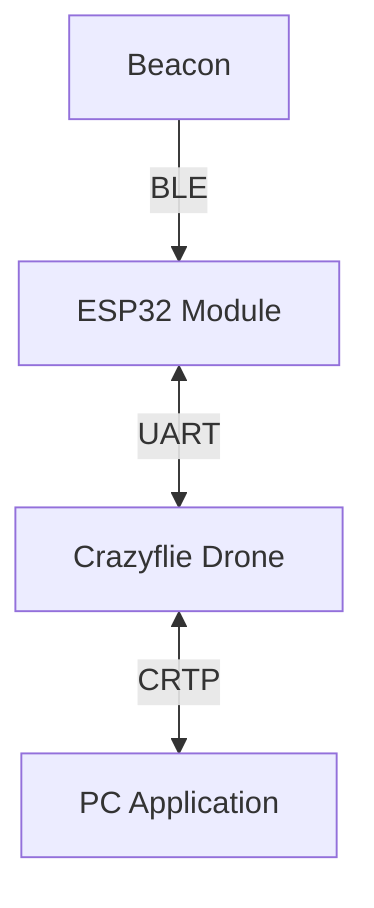

# ASTRA

**ASTRA** (_Autonomous Signal Tracking & Ranging Aircraft_) is an autonomous drone system that locates the source of a Bluetooth Low Energy (BLE) beacon inside a room and navigates towards it.

Built on the Crazyflie 2.1 platform, it combines onboard RSSI sampling performed by an ESP32 module mounted on the drone with the Flow deck motion tracking to estimate and navigate towards the beacon.

The project was developed as a course project for the Cyber Physical Systems Programming course at the University of Bologna.

For a detailed technical analysis of the localization algorithms, hardware constraints, and experimental results, see the [Full Project Report](docs/PROJECT.md).

## System Architecture

The system consists of three main components:

- The Crazyflie drone, which serves as the main platform for navigation and data collection.
- An ESP32 module mounted on the drone, responsible for performing BLE scanning and sampling the RSSI values from the beacon's advertisements.
- A PC application that receives data from the drone, visualizes the estimated position of the beacon, and allows the user to send commands to the drone.




## Hardware Required

The project requires the following hardware components:

- Crazyflie 2.1 drone
  - Flow deck (for stabilization of the internal state estimation)
- ESP32-C3 microcontroller
- BLE beacon (any standard BLE beacon that can advertise its presence)

The choice of the ESP32-C3 was motivated by its low cost and compatibility with the Crazyflie ecosystem, as it is already included in the AI deck.

## Project Structure

The project is organized into the following directories:

- `cf-app`: Contains the code for the Crazyflie application.
- `cf-firmware`: Contains the firmware code for the Crazyflie. It is a git submodule and tracks the official Crazyflie firmware repository.
- `cf-esp-module`: Contains the code for the ESP32 module that will be used mounted on the Crazyflie to perform BLE scanning and signal processing.
- `pc-python`: Contains the code for the PC application that will be used to visualize the data received from the drone and to send commands to it.
- `docs/PROJECT.md`: Comprehensive technical report covering the theory (Trilateration, Gauss-Newton), hardware integration, and evaluation.

## Prerequisites

- A computer with Python 3.12 or later installed (we recommend [uv](https://github.com/astral-sh/uv) for dependency management)
- Git for cloning the repository and its submodules
- PlatformIO for building and flashing the ESP32 firmware
- Crazyflie tools for flashing the Crazyflie firmware

## Hardware Setup

### Pin Connections for the ESP32 module

> [!WARNING]
> Do not use UART 2 for the ESP32 connection!
>
> The Flow Deck uses its RX pin to send motion data to the CF.
> This conflict leads to drift in the state estimator.

#### Using UART 1 (Left side of the board)

| ESP32 Pin       | Crazyflie Pin      | Description                |
| --------------- | ------------------ | -------------------------- |
| 3.3V            | RIGHT PIN 9 (VCOM) | Power supply for the ESP32 |
| GND             | LEFT PIN 10 (GND)  | Ground connection          |
| GPIO_NUM_5 (TX) | LEFT PIN 2 (RX)    | ESP32 TX -> Crazyflie RX   |
| GPIO_NUM_6 (RX) | LEFT PIN 3 (TX)    | Crazyflie TX -> ESP32 RX   |

## Getting Started

To get started with the project, follow these steps:

1. Clone the repository:

   ```bash
   git clone --recursive https://github.com/Ricciolo2001/ASTRA.git
   ```

2. Flash the firmware for the Crazyflie:

   ```bash
   cd cf-firmware
   make
   cfloader flash build/cf2.bin stm32-fw
   ```

3. Build and flash the code for the ESP32 module using PlatformIO:

   ```bash
   cd cf-esp-module
   platformio run --target upload
   ```

4. Set up the Python environment and run the tracking application:

   We recommend using [uv](https://github.com/astral-sh/uv) for fast and reliable dependency management, but you can also use standard `pip`.

   ### Option A: Using uv (Recommended)

   ```bash
   cd pc-python
   uv run track --uri radio://0/40/2M/E7E7E7E7E6 --tx-power -66 --path-loss 4.0 <BEACON_MAC_ADDRESS>
   ```

   ### Option B: Using standard Python & pip

   ```bash
   cd pc-python
   python3 -m venv .venv
   source .venv/bin/activate  # On Windows: .venv\Scripts\activate
   pip install .
   python3 ./scripts/track.py --uri radio://0/40/2M/E7E7E7E7E6 --tx-power -66 --path-loss 4.0 <BEACON_MAC_ADDRESS>
   ```

### Calibration Note

The localization accuracy depends on the path loss exponent (`--path-loss`) and the reference RSSI value (`--tx-power`). These values are environment-dependent. For details on how to determine these parameters, refer to **Section 8 (Experimental Evaluation)** of the [Project Report](docs/PROJECT.md).

## Common Pitfalls & Troubleshooting

- **Lighting & Floor Texture**: The Flow Deck relies on optical flow. Ensure the room is well-lit and the floor has a non-reflective, textured pattern. Avoid monochrome carpets or polished tiles.
- **Battery Level (Voltage Sag)**: Under high motor load or low battery, the supply voltage may drop, causing the ESP32 to provide erratic RSSI readings or reboot. Ensure the battery is well-charged for flight.
- **Stable Hovering**: The system uses aggressive filtering (Median + EMA) to handle RSSI noise. The drone must hover steadily at each waypoint for a few seconds to obtain a clean measurement.
- **Line of Sight**: RSSI is highly sensitive to obstacles. For best results, maintain a clear line of sight between the drone and the beacon.

## Contributions

The project was completed cooperatively by all three team members, with everyone participating in all aspects:

- Alessandro Ricci
- Eyad Issa
- Giulia Pareschi

## License

This project follows the [REUSE 3.3 guidelines](https://reuse.software/) for licensing. You can find a SPDX-License-Identifier in each source file, and the LICENSES directory contains the full text of each license used in the project. Please refer to the LICENSES directory for more information on the licenses used in this project.
