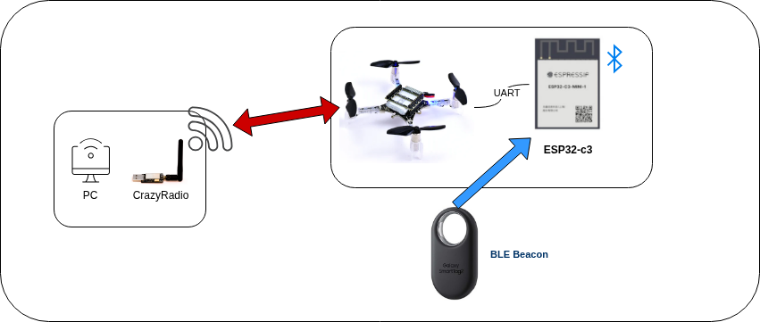

# ASTRA

Autonomous Signal Tracking & Ranging Aircraft is a project that aims to develop an autonomous drone capable of tracking and estimating the position of a signal source.

The drone will be based on the Crazyflie 2.1 platform and will use BLE (Bluetooth Low Energy) beacons for signal tracking.

This project is done for the Cyber Physical Systems Programming (CPSP) course at the University of Bologna.


## Project Structure

The project is organized into the following directories:

- `cf-app`: Contains the code for the Crazyflie application
- `cf-firmware`: Contains the firmware code for the Crazyflie. It is a git submodule and tracks the official Crazyflie firmware repository.
- `cf-esp-module`: Contains the code for the ESP32 module that will be used mounted on the Crazyflie to perform BLE scanning and signal processing.
- `pc-python`: Contains the code for the PC application that will be used to visualize the data received from the drone and to send commands to it.

## Hardware required

The hardware required for this project uses bot top and bottom deck space.  
We used 2 different types of HW:
* Ranger deck used to determine the exact position of the CF
* Esp32 used to determine the distance from the beacon

We decided to use an Esp32-c3 because it's a cheap micorcontroller. An esp32 is also included inside the AI deck, so our project could be replicated with an already existing deck, compatible with the CF ecosystem.


## Comunication schema
 

We use a bidirectional communication channel between the CF and a pc equipped with CrazyRadio.  
We use a BLE beacon to advertise the position that we want to track and an ESP32 mounted on the drone is used to sample the RSSI of that beacon advertisement messages. 
The ESP32 is wired via UART and it uses CRTP.

## Trilateration the position
We are gonna use a BLE beacon that advertise it's presence every 200ms.  
We evaluate the distance using RSSI and a Kalman filter to reduce noise and interference and use an old SLAM project to estimate the CF position inside a room.    
  
This gives us the distance from the point and the exact position of the CF.
This data is sampled multiple times in different locations and after a certain number of measurements we are able to estimate the position of the beacon inside the room with certain accuracy.

## Getting Started

To get started with the project, follow these steps:

1. Clone the repository:

   ```bash
   git clone --recursive https://github.com/Ricciolo2001/ASTRA.git
   ```

2. Flash the firmware for the Crazyflie:

   ```bash
   cd cf-firmware
   make
   cfloader flash build/cf2.bin stm32-fw
   ```

3. Build and flash the code for the ESP32 module using platformIO contained in:
   ```bash
   cf-esp-module
   ```

4. Prepare the PC:
   ```bash
   cd pc-python
   python3 -m venv venv
   source venv/bin/activate
   pip install -r requirements.txt
   ```

5. Run one of the files contained in scripts


## Constraints & Known Issues
Developing on a small drone platform presents several physical and computational challenges.
* Shadowing multipath and interference: The accuracy of RSSI-based ranging is heavily influenced by reflections of the signal and interference caused by high pitch electrical noise. On a small platform like the CF motor drivers are close to the antenna and may affect the quality of the sampled data due to interference in the analog to digital conversion. Having the antenna on a deck close to the body of the drone may also create a shadowing effect or cause more signal reflections.
* Voltage Sag: off the shelf RSSI protocols usually don't take in consideration possible variaton in voltage. The ESP is directly connected to the battery via a bms integrated in the battery that limits the current. When we have hig power demand the voltage might sag lower than the 3.3v supplide to the ESP chip creating invalid measures and in extreme cases forcing the reboot of the device.


## Contributions
The project was completed cooperatively by all three team members, with everyone participating in all aspects.

### CrazyTeam:

* Alessandro Ricci Armandi
* Eissa Eyad
* Giulia Pareschi
   
## Contributing

This project is not open for external contributions as it is a course project. However, if you have any suggestions or feedback, feel free to reach out to the project maintainers via GitHub issues.

## License

This project follows the [REUSE 3.3 guidelines](https://reuse.software/) for licensing. You can find a SPDX-License-Identifier in each source file, and the LICENSES directory contains the full text of each license used in the project. Please refer to the LICENSES directory for more information on the licenses used in this project.
