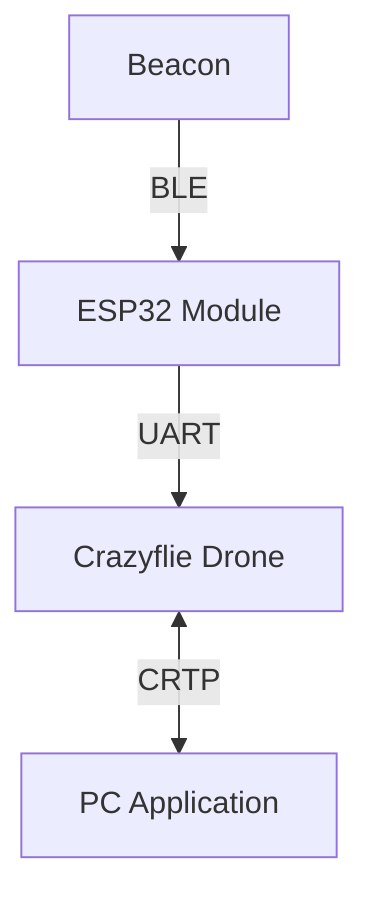

# ASTRA

**ASTRA** (_Autonomous Signal Tracking & Ranging Aircraft_) is an autonomous drone system that locates the source of a Bluetooth Low Energy (BLE) beacon inside a room and navigates towards it.

Built on the Crazyflie 2.1 platform, it combines onboard RSSI sampling performed by an ESP32 module mounted on the drone with a SLAM-based positioning system to iteratively estimate the beacon's position through trilateration.

Developed as a course project for Cyber Physical Systems Programming at the University of Bologna, ASTRA demonstrates how low-cost, off-the-shelf hardware can be combined to tackle indoor localization without relying on GPS or fixed infrastructure.

## System Architecture

The system consists of three main components:

- The Crazyflie drone, which serves as the main platform for navigation and data collection.
- An ESP32 module mounted on the drone, responsible for performing BLE scanning and sampling the RSSI values from the beacon's advertisements.
- A PC application that receives data from the drone, visualizes the estimated position of the beacon, and allows the user to send commands to the drone.



## Hardware Required

The project requires the following hardware components:

- Crazyflie 2.1 drone
  - Ranger deck (for SLAM-based positioning)
  - Flow deck (for stabilization of the internal state estimation)
- ESP32-C3 microcontroller
- BLE beacon (any standard BLE beacon that can advertise its presence)

The choice of the ESP32-C3 was motivated by its low cost and compatibility with the Crazyflie ecosystem, as it is already included in the AI deck. This allows for easy replication of the project using existing and already available hardware components.

## Localization and Navigation

To understand where the beacon is located, we first need to understand where the drone is. For that, we use a SLAM-based positioning system that combines data from the Ranger deck and the Flow deck to estimate the drone's position inside a room.

### Using SLAM for drone positioning

The SLAM (Simultaneous Localization and Mapping) algorithm allows the drone to build a map of the environment while simultaneously estimating its own position within that map.
The Ranger deck provides depth information about the surroundings, while the Flow deck helps with stabilization and accurate estimation of the drone's movement.
By fusing the data from these two decks, we can obtain a reliable estimate of the drone's position and of a map of the environment.

### Beacon localization

To estimate the position of the beacon, we use trilateration, which is a method of determining the position of a point based on its distance from three or more known points. In our case, the known points are the positions of the drone at different locations inside the room. The beacon's distance from the drone is estimated using the RSSI values sampled by the ESP32 module.

To account for the noise and interference in the RSSI measurements, we apply a Kalman filter to the sampled RSSI values.

### Navigation towards the beacon

The system (should) supports two navigation strategies:

- Using the estimated position of the beacon to send a setpoint to the drone and navigate towards it using the built-in position controller of the Crazyflie.

- Doing a gradient ascent on the RSSI values, which means that we continuously sample the RSSI values and move in the direction of the highest RSSI value until we reach the beacon.

## Communication schema

The communication between the components is structured as follows:

### Beacon to ESP32

BLE beacons advertise their presence by broadcasting advertisement messages at regular intervals. The ESP32 module mounted on the Crazyflie scans for these advertisements and samples the RSSI values, which are then used to estimate the distance to the beacon.

When the ESP32 is not bound, it continuously scans for BLE advertisements, but does not store or send any data to the Crazyflie. Once it receives a BIND command with a specific BLE MAC address, it starts sampling the RSSI values for that beacon and sends the data back to the Crazyflie at regular intervals.

### ESP32 to Crazyflie

Between the ESP32 and the Crazyflie, we use a UART communication channel to exchange data. Since UART is a simple serial communication protocol, we have to ensure a proper data format and reliable transmission. For that we encode the data using COBS (Consistent Overhead Byte Stuffing) and we append a CRC16 checksum to ensure data integrity.

### Crazyflie to PC

The CF exposes the bound beacon's MAC address as a Crazyflie parameter, and the received RSSI as logging variables.

The Crazyflie system then handles the communication with the PC using the Crazy Real-Time Protocol (CRTP) over a bidirectional communication channel established by the CrazyRadio USB dongle.

## Project Structure

The project is organized into the following directories:

- `cf-app`: Contains the code for the Crazyflie application
- `cf-firmware`: Contains the firmware code for the Crazyflie. It is a git submodule and tracks the official Crazyflie firmware repository.
- `cf-esp-module`: Contains the code for the ESP32 module that will be used mounted on the Crazyflie to perform BLE scanning and signal processing.
- `pc-python`: Contains the code for the PC application that will be used to visualize the data received from the drone and to send commands to it.

## Prerequisites

- A computer with Python 3.12 or later installed
- Git for cloning the repository and its submodules
- PlatformIO for building and flashing the ESP32 firmware
- Crazyflie tools for flashing the Crazyflie firmware

## Getting Started

To get started with the project, follow these steps:

1. Clone the repository:

   ```bash
   git clone --recursive https://github.com/Ricciolo2001/ASTRA.git
   ```

2. Flash the firmware for the Crazyflie:

   ```bash
   cd cf-firmware
   make
   cfloader flash build/cf2.bin stm32-fw
   ```

3. Build and flash the code for the ESP32 module using PlatformIO:

   ```bash
   cd cf-esp-module
   platformio run --target upload
   ```

4. Set up the Python environment for the PC application:

   ```bash
   cd pc-python
   python3 -m venv venv
   source venv/bin/activate
   pip install -r requirements.txt
   ```

5. Run one of the files contained in `pc-python/scripts`:

   ```bash
   python pc-python/scripts/slam.py
   ```

## Constraints & Known Issues

Using a small drone platform like the Crazyflie comes with several constraints and challenges that we had to take into account during the development of the project.

- **Shadowing multipath and interference**:
  The accuracy of RSSI-based ranging is heavily influenced by reflections of the signal and interference caused by high-frequency electrical noise.
  On a small platform like the CF motor drivers are close to the antenna and may affect the quality of the sampled data due to interference in the analog to digital conversion.
  Having the antenna on a deck close to the body of the drone may also create a shadowing effect or cause more signal reflections.

- **Voltage Sag**:
  Off-the-shelf RSSI protocols usually don't take in consideration possible variation in voltage.
  In our case, the ESP is directly connected to the battery via a BMS integrated in the battery that limits the current.
  When we have high power demand the voltage might sag lower than the 3.3v supplied to the ESP chip, creating invalid measures and in extreme cases forcing the reboot of the device.

## Challenges
### State estimator problems
When we started testing software components that required the use of the StateEstimator we encountered several issues.  
Logged values where unstabl and the posistions estimate was unstable resulting in a drift in the measurements.  
We tried to fix the Kalman algorithm by first forcing a reset using the command  
```scf.cf.param.set_value('kalman.resetEstimation', '1')```  
and them we tried to fix the drifting valyues by desensibilizing the ```scf.cf.param.set_value('kalman.mNGyro_rollpitch', '0.01')```  
but both changes failed.  

Aftes a deep analysys of the board we concluded that probably there were some elecrrical problems due to the presence of oxydation on the board; and also it was dirty.  
After disassembling and cleaning the CF PCB using 99% isopropanol and an ultrasonic vat the values became stable without drifting and the problem was solved

### BLE and crazy radio incompatible
In the first version of the project we wanted to use the BEL capabilities of the CF to scan for BLE beacons, but BLE and crazyradio are mutually excluesive so this was not possible so we started using an esp32 connected via UART.


## Contributions

The project was completed cooperatively by all three team members, with everyone participating in all aspects:

- Alessandro Ricci Armandi
- Eyad Issa
- Giulia Pareschi

## Acknowledgements

We would like to thank JustFanta01 and their team for their previous work on SLAM with the Crazyflie, which provided valuable insights and code that we were able to build upon for our project. You can find their work here: <https://github.com/JustFanta01/Crazyflie_slam>


## License

This project follows the [REUSE 3.3 guidelines](https://reuse.software/) for licensing. You can find a SPDX-License-Identifier in each source file, and the LICENSES directory contains the full text of each license used in the project. Please refer to the LICENSES directory for more information on the licenses used in this project.
