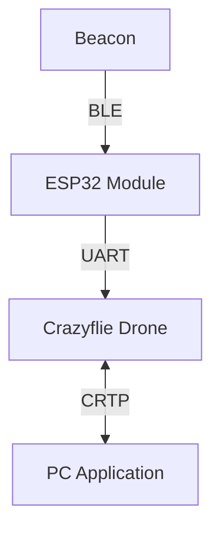

# ASTRA

**ASTRA** (_Autonomous Signal Tracking & Ranging Aircraft_) is an autonomous drone system that locates the source of a Bluetooth Low Energy (BLE) beacon inside a room and navigates towards it.

Built on the Crazyflie 2.1 platform, it combines onboard RSSI sampling performed by an ESP32 module mounted on the drone with the Flow deck motion tracking to estimate and navigate towards the beacon.

The project was developed as a course project for the Cyber Physical Systems Programming course at the University of Bologna.

## System Architecture

The system consists of three main components:

- The Crazyflie drone, which serves as the main platform for navigation and data collection.
- An ESP32 module mounted on the drone, responsible for performing BLE scanning and sampling the RSSI values from the beacon's advertisements.
- A PC application that receives data from the drone, visualizes the estimated position of the beacon, and allows the user to send commands to the drone.



## Hardware Required

The project requires the following hardware components:

- Crazyflie 2.1 drone
  - Flow deck (for stabilization of the internal state estimation)
- ESP32-C3 microcontroller
- BLE beacon (any standard BLE beacon that can advertise its presence)

The choice of the ESP32-C3 was motivated by its low cost and compatibility with the Crazyflie ecosystem, as it is already included in the AI deck.

## Localization and Navigation

To locate the beacon, we only rely on the RSSI values sampled by the ESP32 module. The beacon continuously advertises its presence, and the ESP32 samples the RSSI values of these advertisements to estimate the distance to the beacon.

The drone moves and iteratively estimates the position of the beacon using trilateration, which is a method for determining the position of a point based on its distance from three or more known points.

To account for the noise and interference in the RSSI measurements, we apply a strong Median & EMA filter to the sampled RSSI values during the capture phase. For this reason, we let the drone land before starting the capture.

## Communication schema

The communication between the components is structured as follows:

### Beacon to ESP32

BLE beacons advertise their presence by broadcasting advertisement messages at regular intervals.
The ESP32 module mounted on the Crazyflie scans for these advertisements and samples the RSSI values, which are then used to estimate the distance to the beacon.

When the ESP32 is not bound, it continuously scans for BLE advertisements, but does not store or send any data to the Crazyflie.
Once it receives a BIND command with a specific BLE MAC address, it starts sampling the RSSI values for that beacon and sends the data back to the Crazyflie at regular intervals.

### ESP32 to Crazyflie

Between the ESP32 and the Crazyflie, we use a UART communication channel to exchange data.

Since UART is a simple serial communication protocol, we have to ensure a proper data format and reliable transmission. For that we encode the data using COBS (Consistent Overhead Byte Stuffing) and we append a CRC16 checksum to ensure data integrity.

### Crazyflie to PC

The CF exposes the bound beacon's MAC address as a Crazyflie parameter, and the received RSSI as logging variables.

The Crazyflie system then handles the communication with the PC using the Crazy Real-Time Protocol (CRTP) over a bidirectional communication channel established by the CrazyRadio USB dongle.

## Project Structure

The project is organized into the following directories:

- `cf-app`: Contains the code for the Crazyflie application
- `cf-firmware`: Contains the firmware code for the Crazyflie. It is a git submodule and tracks the official Crazyflie firmware repository.
- `cf-esp-module`: Contains the code for the ESP32 module that will be used mounted on the Crazyflie to perform BLE scanning and signal processing.
- `pc-python`: Contains the code for the PC application that will be used to visualize the data received from the drone and to send commands to it.

## Prerequisites

- A computer with Python 3.12 or later installed
- Git for cloning the repository and its submodules
- PlatformIO for building and flashing the ESP32 firmware
- Crazyflie tools for flashing the Crazyflie firmware

## Hardware Setup

### Pin Connections for the ESP32 module

> [!WARNING]
> Do not use UART 2 for the ESP32 connection!
>
> Although we initially tried UART 2 (on the right side of the board), the Flow Deck uses its RX pin to send motion data to the CF.
>
> This conflict led to drift in the state estimator.

#### Using UART 1 (Left side of the board)

| ESP32 Pin       | Crazyflie Pin      | Description                |
| --------------- | ------------------ | -------------------------- |
| 3.3V            | RIGHT PIN 9 (VCOM) | Power supply for the ESP32 |
| GND             | LEFT PIN 10 (GND)  | Ground connection          |
| GPIO_NUM_5 (TX) | LEFT PIN 2 (RX)    | ESP32 TX -> Crazyflie RX   |
| GPIO_NUM_6 (RX) | LEFT PIN 3 (TX)    | Crazyflie TX -> ESP32 RX   |

## Getting Started

To get started with the project, follow these steps:

1. Clone the repository:

   ```bash
   git clone --recursive https://github.com/Ricciolo2001/ASTRA.git
   ```

2. Flash the firmware for the Crazyflie:

   ```bash
   cd cf-firmware
   make
   cfloader flash build/cf2.bin stm32-fw
   ```

3. Build and flash the code for the ESP32 module using PlatformIO:

   ```bash
   cd cf-esp-module
   platformio run --target upload
   ```

4. Set up the Python environment for the PC application:

   ```bash
   cd pc-python
   python3 -m venv venv
   source venv/bin/activate
   pip install -r requirements.txt
   ```

5. Run one of the files contained in `pc-python/scripts`:

   ```bash
   python pc-python/scripts/slam.py
   ```

## Constraints & Known Issues

Using a small drone platform like the Crazyflie comes with several constraints and challenges that we had to take into account during the development of the project.

- **Shadowing multipath and interference**:
  The accuracy of RSSI-based ranging is heavily influenced by reflections of the signal and interference caused by high-frequency electrical noise.
  On a small platform like the CF motor drivers are close to the antenna and may affect the quality of the sampled data due to interference in the analog to digital conversion.
  Having the antenna on a deck close to the body of the drone may also create a shadowing effect or cause more signal reflections.

- **Voltage Sag**:
  Off-the-shelf RSSI protocols usually don't take in consideration possible variation in voltage.
  In our case, the ESP is directly connected to the battery via a BMS integrated in the battery that limits the current.
  When we have high power demand the voltage might sag lower than the 3.3v supplied to the ESP chip, creating invalid measures and in extreme cases forcing the reboot of the device.

## Challenges and Future Improvements

### Crazyflie BLE

The Crazyflie 2.1 has built-in BLE capabilities, but they are not compatible with the CrazyRadio protocol. From the [Crazyflie documentation](https://www.bitcraze.io/documentation/repository/crazyflie2-nrf-firmware/master/protocols/ble/):

> If the NRF receives any other type of package that is not BLE communication, like crazyradio, OW rewrite or even radio address scanning, the BLE will be disabled. The Crazyflie will need to be restarted in order for the Bluetooth to be enabled again

This means that we cannot use the built-in BLE capabilities of the Crazyflie while using the CrazyRadio for communication with the PC.

Theoretically, the NRF firmware could be modified to expose more "Services" via BLE, but using the same radio for both scanning other BLE devices and communicating with the PC is not something we think is possible.

## Contributions

The project was completed cooperatively by all three team members, with everyone participating in all aspects:

- Alessandro Ricci Armandi
- Eyad Issa
- Giulia Pareschi

## License

This project follows the [REUSE 3.3 guidelines](https://reuse.software/) for licensing. You can find a SPDX-License-Identifier in each source file, and the LICENSES directory contains the full text of each license used in the project. Please refer to the LICENSES directory for more information on the licenses used in this project.

## TODOs

- [ ] Write somewhere that we aggressively filter the RSSI values during capture to reduce noise, so we have to stand still for a few seconds to get a good measure.

- [ ] Add section about CF <-> ESP32 communication protocol, with details about the data format and the use of COBS and CRC16 for reliable transmission.

- [ ] Add "Future Improvements" section with ideas for future work, such as implementing a more sophisticated navigation strategy.
