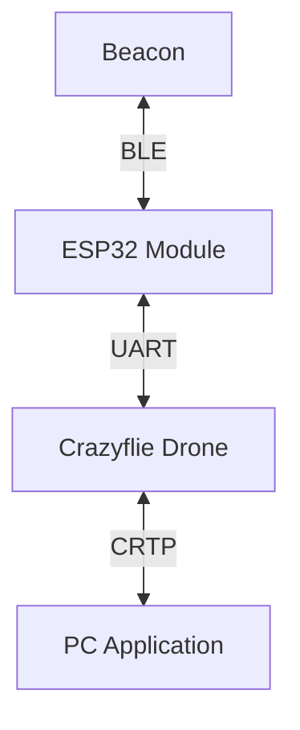

# ASTRA

## 1. Abstract

**ASTRA** (_Autonomous Signal Tracking & Ranging Aircraft_) is an autonomous drone system designed to locate and navigate towards a Bluetooth Low Energy (BLE) beacon inside a room.

Built on the Crazyflie 2.X platform [1], it combines **onboard RSSI sampling**, performed by an ESP32 module mounted on the drone, with the **Flow deck motion tracking** to estimate the beacon's position and guide the drone towards it.

## 2. Introduction & Motivation

Positioning systems such as GPS and UWB are widely used for outdoor and indoor localization; however, they require either direct sky visibility or fixed infrastructure. Camera-based systems, while accurate, demand significant computational resources and are sensitive to lighting conditions.

This project investigates whether BLE RSSI-based localization can provide a viable, infrastructure-free alternative for indoor positioning on resource-constrained nano-drones. By leveraging the modular architecture of the Crazyflie 2.X and the BLE capabilities of the ESP32, the system is designed as a lightweight, low-cost solution that operates without external infrastructure.

## 3. Background

### BLE RSSI Ranging

Bluetooth Low Energy (BLE) is a wireless communication protocol widely used for short-range applications. BLE devices periodically broadcast advertisement packets that can be detected by nearby receivers. The **Received Signal Strength Indicator** (RSSI) of these packets can be used to estimate the distance between the transmitter and receiver using the log-distance path loss model:

$$RSSI = A - 10 \cdot n \cdot \log_{10}(d)$$

Where:

- $A$ is the RSSI value at a reference distance of 1 meter,
- $n$ is the path loss exponent that characterizes the environment,
- $d$ is the distance between the transmitter and receiver.

RSSI is, however, a highly noisy measurement, affected by multipath propagation, interference, and environmental factors. As a result, raw RSSI values are generally unsuitable for direct distance estimation without filtering.

To determine the values for $A$ and $n$, a calibration procedure is typically performed in the target environment, where RSSI values are measured at known distances from the beacon and the parameters are fitted to the data.

### Trilateration

Trilateration is a geometric method used to determine the position of a point based on its distance from three or more known reference points. In a 2D plane, if we have three reference points with known coordinates $(x_i, y_i)$ and their corresponding distances $d_i$ to the target point $(x, y)$, we can derive the following system of equations:

$$(x - x_i)^2 + (y - y_i)^2 = d_i^2 \quad \text{for } i = 1, 2, 3$$

Solving this system allows us to estimate the coordinates of the target point. In practice, due to measurement noise and environmental factors, the equations may not have an exact solution.
To address this, a least-squares optimization approach can be used to find the best estimate of the target position that minimizes the error between the measured distances and the distances calculated from the estimated position.

### Gauss-Newton Optimization

The Gauss-Newton method is an iterative optimization algorithm used to solve non-linear least squares problems, such as the one arising from trilateration with noisy distance measurements. The algorithm starts from an initial guess of the target position and iteratively refines it by linearizing the residuals and solving a linear least squares problem at each step. The update rule can be expressed as:

$$\begin{bmatrix} x_{k+1} \\ y_{k+1} \end{bmatrix} = \begin{bmatrix} x_k \\ y_k \end{bmatrix} - (J^T J)^{-1} J^T r$$

Where:

- $J$ is the Jacobian matrix of the residuals with respect to the parameters,
- $r$ is the vector of residuals, defined as the difference between the measured distances and the distances calculated from the current estimate of the target position.

The method converges to a local minimum of the cost function, which represents the best fit of the estimated position to the measured distances.

### Filtering

Filtering plays a key role in reducing noise in RSSI measurements and improving the stability of the localization process. In this project, we combine a Median filter with an Exponential Moving Average (EMA) filter to process the sampled RSSI values more reliably.

The Median filter is first applied to suppress outliers and sudden spikes in the data. Its output is then passed through the EMA filter, which smooths the signal over time while assigning greater importance to more recent measurements.

The EMA is defined as:

$$EMA_t = \alpha \cdot RSSI_t + (1 - \alpha) \cdot EMA_{t-1}$$

where:

- $EMA_t$ represents the filtered RSSI at time $t$,
- $RSSI_t$ is the raw RSSI measurement at time $t$,
- $\alpha$ is the smoothing factor (between 0 and 1), controlling the balance between responsiveness and stability.

## 4. System Architecture

The system consists of three main components: the Crazyflie drone, an ESP32 coprocessor, and a PC application.



### 4.1 Hardware

### Crazyflie 2.X

The Crazyflie 2.1 is a nano quadcopter used as the main aerial platform [1].

**Role:** Executes flight control, stabilization, and onboard processing.

**Key specifications:**

- Weight: ~27 g
- MCU: STM32F405 (main processor) + nRF51822 (radio)
- Open-source firmware and hardware
- Expansion support via deck system

**Limitations:**

- Limited payload capacity
- Short flight time (~7 minutes)
- Limited onboard computational power

### Flow Deck v2

The Flow Deck v2 is an expansion module mounted underneath the drone [1].

**Role:** Provides relative positioning by measuring motion and distance to the ground.

**Key specifications:**

- Optical flow sensor for lateral motion estimation
- Time-of-Flight (ToF) distance sensor (VL53L1X)
- Effective altitude range: ~0.1–4 m

**Limitations:**

- Requires textured surfaces for accurate tracking
- Performance degrades in low-light or reflective conditions

### ESP32

The ESP32-WROOM-32 is used as a secondary processing and communication unit.

**Role:** Handles BLE communication, beacon detection, and external data processing.

**Key specifications:**

- Dual-core Tensilica CPU up to 240 MHz
- Integrated Wi-Fi and Bluetooth (BLE)
- Rich GPIO and peripheral interfaces

**Limitations:**

- BLE positioning accuracy is limited

### BLE Beacon

A BLE beacon is used as a reference point for localization.

**Role:** Broadcasts Bluetooth signals used to estimate distance or proximity.

**Key specifications:**

- Periodic advertising packets (BLE)
- Low power consumption (battery-powered)
- Configurable transmission interval and power

**Limitations:**

- Signal strength (RSSI) is noisy and environment-dependent
- Accuracy affected by obstacles and interference

### Crazyradio

The Crazyradio PA is a USB communication interface [1].

**Role:** Enables wireless communication between the drone and a ground station (PC).

**Key specifications:**

- 2.4 GHz radio communication
- Low latency link for control and telemetry
- USB interface for easy integration

**Limitations:**

- Susceptible to interference in crowded RF environments

### 4.2 Software

The software stack of the ASTRA system is composed of three components:

1. **Crazyflie custom application:**
   A custom Crazyflie app layer module that implements the localization and navigation logic, processes the RSSI data received from the ESP32, and sends telemetry data to the PC. This module leverages the standard Crazyflie firmware structure [1].

2. **ESP32 firmware:**
   A custom firmware running on the ESP32 module that performs BLE scanning, samples RSSI values, and communicates with the Crazyflie via UART.

3. **PC application:**
   A Python application that uses the `cflib` library to communicate with the Crazyflie, visualize the estimated position of the beacon, and send high-level commands to the drone.

## 5. Communication Protocol

The communication between the components is structured as follows:

- **Beacon to ESP32**
- **ESP32 to Crazyflie**
- **Crazyflie to PC**

### Beacon to ESP32 (BLE)

BLE beacons advertise their presence by broadcasting advertisement messages at regular intervals (200ms).
The ESP32 module mounted on the Crazyflie scans for these advertisements and samples the RSSI values, which are then used to estimate the distance to the beacon.

When the ESP32 is not bound, it continuously scans for BLE advertisements, but it does not store or send any data to the Crazyflie.
Once it receives a BIND command with a specific BLE MAC address, it starts sampling the RSSI values for that beacon and sends the data back to the Crazyflie at regular intervals.

### ESP32 to Crazyflie (UART)

Communication between the ESP32 and the Crazyflie is handled via a UART interface operating at 115200 bps.

Since UART is a simple serial communication protocol, we have to ensure a proper data format and reliable transmission. We use **COBS (Consistent Overhead Byte Stuffing)** for packet framing, ensuring that we can reliably identify the start and end of messages. Additionally, we append a **CRC16 checksum** to each packet to ensure data integrity and detect transmission errors. This communication can be extended to use the **CPX (Crazyflie Packet Exchange)** structure [3] for more complex data routing.

### Crazyflie to PC (CRTP)

The Crazyflie communicates with the host PC via the **Crazy Real-Time Protocol (CRTP)** [2], transported over a bidirectional radio link established through the CrazyRadio USB dongle.

The sampled RSSI values are exposed to the host PC through the standard Crazyflie logging infrastructure.
The MAC address of the target beacon is configurable at runtime as a writable parameter, allowing the host application to bind the system to a specific device without requiring firmware modifications.

## 6. Localization & Navigation

The localization and navigation logic is handled by a mission application running on the host PC, which coordinates the drone's flight phases through high-level commands sent via CRTP.

### Phase 1 — Takeoff

The mission begins by resetting the Kalman state estimator, followed by a takeoff command that brings the drone to a fixed operating altitude of 1.0 m, where it hovers.

### Phase 2 — Data Collection

The drone navigates to a set of predefined waypoints arranged in an L-shaped pattern, with the takeoff point at the corner.
The four waypoints are located at (1.0, 0.0), (1.0, 1.0), (0.0, 1.0), and (0.0, 0.0) meters.

At each waypoint, the drone hovers and collects RSSI samples for a configurable duration (default: 5 s, at 100 ms intervals).
The raw samples are processed through a Median-EMA filter (window = 80, α = 0.15) to produce a single filtered RSSI estimate.
This is then converted to a 3D distance using the log-distance model, and projected onto the 2D ground plane by accounting for the vertical offset $\Delta z$ between the drone and the beacon (assuming the beacon is at a fixed, known height).

$$d_{2D}= \sqrt{d_{3D}^2 - \Delta z^2}$$

Each measurement, consisting of the waypoint coordinates and the estimated 2D distance, is stored in a sliding window of the 6 most recent samples.

### Phase 3 — Initial Estimation

Once at least three valid measurements are available, the system estimates the beacon’s position using a Gauss–Newton optimization based on the collected data. A baseline estimate is also computed using linear least-squares trilateration for comparison.

The Gauss–Newton optimizer is initialized at the position corresponding to the strongest RSSI measurement and applies inverse-square distance-based weighting ($w_i = 1/d_i^2$). This weighting accounts for the logarithmic nature of RSSI: the slope of the distance-to-RSSI curve is much steeper at close range, making measurements of nearby sources significantly more sensitive and reliable than those taken from further away.

Convergence and RMSE are evaluated at each iteration. If the optimizer fails to converge, or if the RMSE exceeds 1.0 m, a warning is logged and the estimate is flagged as unreliable.

### Phase 4 — Closed-Loop Navigation

Once an initial beacon position is estimated, the drone navigates towards it.
The system then enters a continuous refinement loop: new RSSI measurements are collected at the current position, the sliding window is updated, and the beacon estimate is refined.
The drone continuously adjusts its trajectory toward the updated estimate, correcting for drift over time.

To prevent unsafe jumps, target positions are clamped to a maximum displacement of 1.5 m from the drone's current position.

> [!WARN]
> In the current implementation, the drone does not perform obstacle avoidance and does not terminate the mission autonomously.
> The operator must issue a manual landing command to end the flight.

## 7. Experimental Evaluation

Precise tracking requires the algorithms to account for two factors of calibration: the path loss exponent $n$ and the reference RSSI value $A$ at 1 meter. We empirically determined these parameters by performing a calibration procedure in the test environment, measuring the RSSI values at known distances from the beacon and fitting the log-distance path loss model to the data.

After calibration, we conducted a series of test flights in a controlled indoor environment (a 5x5 meter room with typical living room furnishings) to evaluate the localization accuracy and navigation performance of the system. The drone was tasked with locating a BLE beacon placed at various positions within the room, starting from a fixed takeoff point.

The results showed that the system was able to successfully locate the beacon and navigate towards it, with an average localization error of approximately 0.5 meters. The accuracy varied depending on the position of the beacon and the presence of obstacles, with better performance observed in line-of-sight conditions.

### 7.1 Calibration Example

During our final tests in a home environment, we achieved stable results using the following parameters:

- **Reference RSSI (A):** -66 dBm
- **Path Loss Exponent (n):** 4.0
- **Sample Number:** 80

These can be applied in the tracking script as follows:

```bash
uv run track --uri radio://0/40/2M/E7E7E7E7E6 --tx-power -66 --path-loss 4.0 --sample-num 80 <BEACON_MAC_ADDRESS>
```

## 8. Issues Encountered

### 8.1 UART Conflict with Flow Deck v2

During hardware integration, a conflict emerged between the ESP32 coprocessor and the Flow Deck v2.

When tested independently, both the ESP32 and the Flow Deck v2 operated correctly. However, once integrated, the drone’s state estimation performance degraded significantly, resulting in noticeable accumulated drift.

Further investigation of the documentation and hardware schematics revealed that both components were sharing the same UART2 interface on the Crazyflie. The Flow Deck v2 relies on UART2 to stream motion data to the onboard state estimator. Simultaneous transmissions from the ESP32 on this interface introduced interference, corrupting the flow data stream and ultimately degrading position estimation accuracy.

**Resolution:**

The issue was resolved by rerouting the ESP32 communication to UART1, which is not used by any of the active deck drivers. This eliminated the interference and restored stable state estimation.

### 8.2 Streaming Data from ESP32 to PC

In the early stages, we implemented a custom application-layer, text-based protocol to stream data directly between the PC and the ESP32, using the Crazyflie as a transparent relay. This approach initially proved useful, as it simplified debugging of BLE scanning, RSSI sampling, and command handling on the ESP32.

However, as development progressed—particularly for localization and navigation on the Crazyflie—this architecture became increasingly impractical. The core issue was its separation from the existing Crazyflie logging system. As a result, we were forced to monitor two independent channels: the standard logging interface for telemetry and the custom protocol for ESP32 data.

**Resolution:**

To address this, we integrated the ESP32 data stream into the standard Crazyflie logging infrastructure. Sampled RSSI values were exposed as regular log variables, while the associated beacon MAC address was implemented as a writable parameter. This unified approach simplified data access and improved overall system maintainability.

## 9. Constraints & Known Issues

Deploying the system on a small platform such as the Crazyflie introduces several hardware and environmental constraints that were taken into account during development.

- **Shadowing, Multipath and RF Interference:**
  RSSI-based ranging is inherently sensitive to multipath propagation and electromagnetic interference. On a compact platform, motor drivers and switching power electronics are in close physical proximity to the radio antenna, introducing high-frequency noise that may corrupt the analog-to-digital conversion of the received signal. Additionally, mounting the ESP32 coprocessor on a deck immediately above the drone body can produce a shadowing effect, further degrading signal quality and increasing measurement variance.

- **Voltage Sag:**
  Standard RSSI measurement pipelines do not account for supply voltage variations. In our configuration, the ESP32 is powered directly from the LiPo battery through the integrated battery management system (BMS). Under high power demand, the supply rail may drop below the 3.3 V nominal operating voltage of the ESP32, causing erroneous RSSI readings and, in severe cases, triggering an unintended device reboot that interrupts the ranging pipeline.

- **Top Deck Occupancy:**
  Interfacing the ESP32 coprocessor with the Crazyflie requires use of UART1, the only UART interface not allocated by onboard deck drivers. Routing this connection through the deck connector physically occupies the top expansion port, precluding the simultaneous use of any additional deck hardware that relies on the same connector.

- **Manual Movement Noise:**
  Manual positioning or rapid movement during the sampling phase introduces significant noise that exceeds the capabilities of the Median-EMA filter. This necessitates a stable hover for reliable estimation.

## 10. Conclusions & Future Work

ASTRA demonstrated that BLE RSSI-based localization is feasible on a nano-drone platform, successfully locating a beacon within a 5×5 m indoor environment with an average error of approximately 0.5 m. The system operated without any external infrastructure beyond the beacon itself, validating the core premise of the project.

### Hardware improvements

One potential improvement is to migrate the beacon scanning and distance estimation directly onto the nRF52840 microcontroller already onboard the Crazyflie, leveraging existing BLE support in the nRF firmware [4]. This would eliminate the need for the ESP32 and free up the top deck expansion port for additional sensors.

Alternatively, a simpler approach would be to use longer deck pins, allowing the ESP32 to be stacked with other expansion decks while still communicating via UART1, which is not used by the Ranger deck. This configuration would enable simultaneous use of the Ranger deck, providing obstacle distance measurements in all horizontal directions.

### Algorithmic improvements

Although the hardware setup would support adding a Ranger deck, the Extended Kalman Filter (EKF) does not currently incorporate these measurements for horizontal positioning. Integrating this data could improve the accuracy and robustness of the estimate, aligning with ongoing community efforts such as [Bitcraze PR #823](https://github.com/bitcraze/crazyflie-firmware/pull/823).

Furthermore, once the system converges on a beacon estimate, the position scheduler tends to repeatedly return the same target coordinates, causing the drone to hover in place even if the estimate is inaccurate. This occurs because new measurements collected at the same location do not add geometric diversity to the sliding window. The position scheduler could be extended to introduce deliberate positional perturbations when stagnation is detected, maintaining geometric diversity and allowing the trilateration process to continue refining the estimate.

## 11. References

[1] [Bitcraze Documentation Repository](https://www.bitcraze.io/documentation/repository/)
[2] [CRTP Communication Protocol](https://www.bitcraze.io/documentation/repository/Crazyflie-firmware/master/functional-areas/crtp/)
[3] [CPX Packet Structure](https://www.bitcraze.io/documentation/repository/Crazyflie-firmware/master/functional-areas/cpx/)
[4] [BLE and Crazyradio on nRF52](https://www.bitcraze.io/documentation/repository/Crazyflie2-nrf-firmware/master/protocols/ble/)

## 12. Contributions

The project was completed cooperatively by all three team members, with everyone participating in all aspects:

- Alessandro Ricci
- Eyad Issa
- Giulia Pareschi
