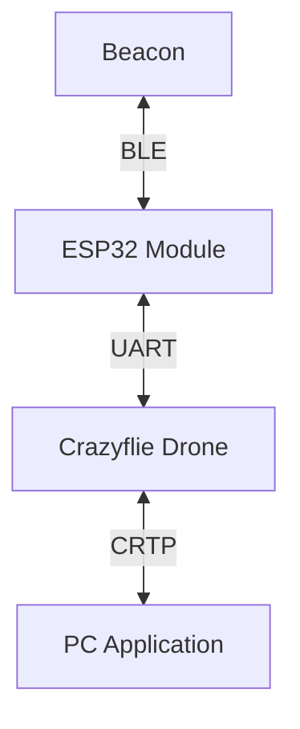

# ASTRA

## 1. Abstract

**ASTRA** (_Autonomous Signal Tracking & Ranging Aircraft_) is an autonomous drone system designed to locate and navigate towards a Bluetooth Low Energy (BLE) beacon inside a room.

Built on the Crazyflie 2.X platform, it combines **onboard RSSI sampling**, performed by an ESP32 module mounted on the drone, with the **Flow deck motion tracking** to estimate the beacon's position and guide the drone towards it.

## 2. Introduction & Motivation

Indoor localization is a fundamental challenge in Cyber-Physical Systems, where GPS signals are unavailable or unreliable. Solutions such as UWB or camera-based systems offer high accuracy but require fixed infrastructure or significant computational resources, making impractical for lightweight platforms.

ASTRA explores the feasibility of BLE RSSI-based localization on a nano-drone, leveraging the Crazyflie 2.X's modular architecture and the ESP32's BLE capabilities to navigate towards a beacon without any external dependency.

## 3. Background

### BLE RSSI Ranging

Bluetooth Low Energy (BLE) is a wireless communication protocol widely used for short-range applications. BLE devices periodically broadcast advertisement packets that can be detected by nearby receivers. The **Received Signal Strength Indicator** (RSSI) of these packets can be used to estimate the distance between the transmitter and receiver using the log-distance path loss model:

$$RSSI = A - 10 \cdot n \cdot \log_{10}(d)$$

Where:

- $A$ is the RSSI value at a reference distance of 1 meter,
- $n$ is the path loss exponent that characterizes the environment,
- $d$ is the distance between the transmitter and receiver.

We ought to keep in mind that the RSSI is a highly noisy measurement, affected by multipath propagation, interference, and environmental factors.

### Trilateration

Trilateration is a geometric method used to determine the position of a point based on its distance from three or more known reference points. In a 2D plane, if we have three reference points with known coordinates $(x_i, y_i)$ and their corresponding distances $d_i$ to the target point $(x, y)$, we can derive the following system of equations:

$$(x - x_i)^2 + (y - y_i)^2 = d_i^2 \quad \text{for } i = 1, 2, 3$$

Solving this system allows us to estimate the coordinates of the target point. In practice, due to measurement noise and environmental factors, the equations may not have an exact solution. To account for this, a least-squares optimization approach can be used to find the best estimate of the target position that minimizes the error between the measured distances and the distances calculated from the estimated position.

### Gauss-Newton Optimization

The Gauss-Newton method is an iterative optimization algorithm used to solve non-linear least squares problems, such as the one arising from trilateration with noisy distance measurements. The algorithm starts from a initial guess of the target position and iteratively refines it by linearizing the residuals and solving a linear least squares problem at each step. The update rule can be expressed as:

$$\begin{bmatrix} x_{k+1} \\ y_{k+1} \end{bmatrix} = \begin{bmatrix} x_k \\ y_k \end{bmatrix} - (J^T J)^{-1} J^T r$$

Where:

- $J$ is the Jacobian matrix of the residuals with respect to the parameters,
- $r$ is the vector of residuals, defined as the difference between the measured distances and the distances calculated from the current estimate of the target position.

The method converges to a local minimum of the cost function, which represents the best fit of the estimated position to the measured distances.

### Filtering

Filtering plays a key role in reducing noise in RSSI measurements and improving the stability of the localization process. In this project, we combine a Median filter with an Exponential Moving Average (EMA) filter to process the sampled RSSI values more reliably.

The Median filter is first applied to suppress outliers and sudden spikes in the data. Its output is then passed through the EMA filter, which smooths the signal over time while assigning greater importance to more recent measurements.

The EMA is defined as:

$$EMA_t = \alpha \cdot RSSI_t + (1 - \alpha) \cdot EMA_{t-1}$$

where:

- $EMA_t$ represents the filtered RSSI at time $t$,
- $RSSI_t$ is the raw RSSI measurement at time $t$,
- $\alpha$ is the smoothing factor (between 0 and 1), controlling the balance between responsiveness and stability.

## 4. System Architecture

The system consists of three main components:

- The Crazyflie drone, which serves as the main platform for navigation and data collection.

- An ESP32 module mounted on the drone and connected via UART, which acts as a coprocessor for performing BLE scanning and sampling the RSSI values from the beacon's advertisements.

- A PC application that receives data from the drone, visualizes the estimated position of the beacon, and allows the user to send commands to the drone.



### 4.1 Hardware

<!--
Lista componente per componente: Crazyflie 2.X, Flow Deck v2, ESP32 (modello esatto), beacon BLE usato, CrazyRadio. Per ognuno: ruolo, specifiche rilevanti, eventuali limitazioni.
-->

### Crazyflie 2.X

The Crazyflie 2.1 is a nano quadcopter used as the main aerial platform.

**Role:** Executes flight control, stabilization, and onboard processing.

**Key specifications:**

- Weight: ~27 g
- MCU: STM32F405 (main processor) + nRF51822 (radio)
- Open-source firmware and hardware
- Expansion support via deck system

**Limitations:**

- Limited payload capacity
- Short flight time (~7 minutes)
- Limited onboard computational power

### Flow Deck v2

The Flow Deck v2 is an expansion module mounted underneath the drone.

**Role:** Provides relative positioning by measuring motion and distance to the ground.

**Key specifications:**

- Optical flow sensor for lateral motion estimation
- Time-of-Flight (ToF) distance sensor (VL53L1X)
- Effective altitude range: ~0.1–4 m

**Limitations:**

- Requires textured surfaces for accurate tracking
- Performance degrades in low-light or reflective conditions

### ESP32

The ESP32-WROOM-32 is used as a secondary processing and communication unit.

**Role:** Handles BLE communication, beacon detection, and external data processing.

**Key specifications:**

- Dual-core Tensilica CPU up to 240 MHz
- Integrated Wi-Fi and Bluetooth (BLE)
- Rich GPIO and peripheral interfaces

**Limitations:**

- Power consumption can be significant
- BLE positioning accuracy is limited

### BLE Beacon

A BLE beacon is used as a reference point for localization.

**Role:** Broadcasts Bluetooth signals used to estimate distance or proximity.

**Key specifications:**

- Periodic advertising packets (BLE)
- Low power consumption (battery-powered)
- Configurable transmission interval and power

**Limitations:**

- Signal strength (RSSI) is noisy and environment-dependent
- Accuracy affected by obstacles and interference

### Crazyradio

The Crazyradio PA is a USB communication interface.

**Role:** Enables wireless communication between the drone and a ground station (PC).

**Key specifications:**

- 2.4 GHz radio communication
- Low latency link for control and telemetry
- USB interface for easy integration

**Limitations:**

- Limited communication range (~1 km line-of-sight, much less indoors)
- Susceptible to interference in crowded RF environments

### 4.2 Software

The software stack of the ASTRA system is composed of three components:

1. **Crazyflie custom application:** A custom application running on the Crazyflie that implements the localization and navigation logic, processes the RSSI data received from the ESP32, and sends telemetry data to the PC.

2. **ESP32 firmware:** A custom firmware running on the ESP32 module that performs BLE scanning, samples RSSI values, and communicates with the Crazyflie via UART.

3. **PC application:** A Python application that uses the `cflib` library to communicate with the Crazyflie, visualize the estimated position of the beacon, and send high level commands to the drone.

## 5. Communication Protocol

The communication between the components is structured as follows:

- **ESP32 to beacon**
- **Communication between ESP32 and Crazyflie**
- **Drone to PC via crazyradio**

### Beacon to ESP32

BLE beacons advertise their presence by broadcasting advertisement messages at regular intervals (200ms).
The ESP32 module mounted on the Crazyflie scans for these advertisements and samples the RSSI values, which are then used to estimate the distance to the beacon.

When the ESP32 is not bound, it continuously scans for BLE advertisements, but it does not store or send any data to the Crazyflie.
Once it receives a BIND command with a specific BLE MAC address, it starts sampling the RSSI values for that beacon and sends the data back to the Crazyflie at regular intervals.

### ESP32 to Crazyflie

Between the ESP32 and the Crazyflie, we use a UART communication channel to exchange data.

Since UART is a simple serial communication protocol, we have to ensure a proper data format and reliable transmission. For that we encode the data using COBS (Consistent Overhead Byte Stuffing) and we append a CRC16 checksum to ensure data integrity.

### Crazyflie to PC

The CrazyFlie communicates with the host PC via the Crazy Real-Time Protocol (CRTP), transported over a bidirectional radio link established through the CrazyRadio USB dongle.
BLE beacon RSSI sampled value is exposed through the standard CrazyFlie parameter and logging infrastructure.
The MAC address of the target beacon is configurable at runtime as a writable parameter, allowing the host application to bind the system to a specific device without requiring firmware modifications.

## 6. Localization Algorithm

To locate the beacon, we rely only on the RSSI sampled values coming from the ESP32 module.
The BLE advertiser continuously sends messages that we can sample to estimate the distance from it.

The drone estimates the position of the beacon using trilateration, which is a method to determine the position of a point based on its distance from three or more known points.

To account for the noise and interference in the RSSI measurements, we apply a strong Median & EMA filter to the sampled RSSI values during the capture phase and we repeat more than 3 measurements to confirm the exact position of the beacon.

## 7. Navigation Strategy

The navigation strategy is handled by a mission application running on the host PC, which coordinates the drone's flight phases through high-level commands sent via CRTP.

**Phase 1 — Takeoff:**
The mission begins with a takeoff command that brings the drone to a fixed operating altitude, where it hovers.

**Phase 2 — Sampling Grid:**
The drone navigates to a set of predefined waypoints arranged in an L pattern with the takeoff point at the corner.
At each waypoint, the drone hovers while the ESP32 collects and filters RSSI samples.
A minimum of three valid distance estimates at distinct locations are required before proceeding to localization.

**Phase 3 — Localization & Tracking:**
Once sufficient samples are collected, the trilateration algorithm produces an initial estimate of the beacon position and the drone navigates towards it.
The system then enters a continuous refinement loop: new RSSI measurements are collected at the current position, the beacon estimate is updated, and the drone adjusts its trajectory accordingly.

This loop runs indefinitely, keeping the drone hovering above the estimated beacon position and correcting for drift in the estimate over time.

> [!WARN]
> In the current implementation, the drone does not perform obstacle avoidance and does not terminate the mission autonomously.
> The operator must issue a manual landing command to end the flight.

## 8. Experimental Evaluation

Precise tracking requires the algorithms to account for two factors of calibration: the path loss exponent $n$ and the reference RSSI value $A$ at 1 meter. We empirically determined these parameters by performing a calibration procedure in the test environment, measuring the RSSI values at known distances from the beacon and fitting the log-distance path loss model to the data.

After calibration, we conducted a series of test flights in a controlled indoor environment (a 5x5 meter room with typical living room furnishings) to evaluate the localization accuracy and navigation performance of the system. The drone was tasked with locating a BLE beacon placed at various positions within the room, starting from a fixed takeoff point.

The results showed that the system was able to successfully locate the beacon and navigate towards it, with an average localization error of approximately 0.5 meters. The accuracy varied depending on the position of the beacon and the presence of obstacles, with better performance observed in line-of-sight conditions.

<!--
TODO: aggiungere grafici o tabelle con i risultati quantitativi, se disponibili.
Ad esempio, una tabella con le posizioni reali vs stimate del beacon, o un grafico che mostra la traiettoria del drone durante il test.
-->

## 9. Issues Encountered

### 9.1 UART Conflict with Flow Deck v2

During hardware integration, a conflict emerged between the ESP32 coprocessor and the Flow Deck v2.

When tested independently, both the ESP32 and the Flow Deck v2 operated correctly. However, once integrated, the drone’s state estimation performance degraded significantly, resulting in noticeable accumulated drift.

Further investigation of the documentation and hardware schematics revealed that both components were sharing the same UART2 interface on the Crazyflie. The Flow Deck v2 relies on UART2 to stream motion data to the onboard state estimator. Simultaneous transmissions from the ESP32 on this interface introduced interference, corrupting the flow data stream and ultimately degrading position estimation accuracy.

**Resolution:**

The issue was resolved by rerouting the ESP32 communication to UART1, which is not used by any of the active deck drivers. This eliminated the interference and restored stable state estimation.

### 9.2 Streaming Data from ESP32 to PC

In the early stages, we implemented a custom application-layer, text-based protocol to stream data directly between the PC and the ESP32, using the Crazyflie as a transparent relay. This approach initially proved useful, as it simplified debugging of BLE scanning, RSSI sampling, and command handling on the ESP32.

However, as development progressed—particularly for localization and navigation on the Crazyflie—this architecture became increasingly impractical. The core issue was its separation from the existing Crazyflie logging system. As a result, we were forced to monitor two independent channels: the standard logging interface for telemetry and the custom protocol for ESP32 data.

**Resolution:**

To address this, we integrated the ESP32 data stream into the standard Crazyflie logging infrastructure. Sampled RSSI values were exposed as regular log variables, while the associated beacon MAC address was implemented as a writable parameter. This unified approach simplified data access and improved overall system maintainability.

## 9. Constraints & Known Issues

Deploying the system on a small platform such as the CrazyFlie introduces several hardware and environmental constraints that were taken into account during development.

- **Shadowing, Multipath and RF Interference:**
  RSSI-based ranging is inherently sensitive to multipath propagation and electromagnetic interference. On a compact platform, motor drivers and switching power electronics are in close physical proximity to the radio antenna, introducing high-frequency noise that may corrupt the analog-to-digital conversion of the received signal. Additionally, mounting the ESP32 coprocessor on a deck immediately above the drone body can produce a shadowing effect, further degrading signal quality and increasing measurement variance.

- **Voltage Sag:**
  Standard RSSI measurement pipelines do not account for supply voltage variations. In our configuration, the ESP32 is powered directly from the LiPo battery through the integrated battery management system (BMS). Under high power demand, the supply rail may drop below the 3.3 V nominal operating voltage of the ESP32, causing erroneous RSSI readings and, in severe cases, triggering an unintended device reboot that interrupts the ranging pipeline.

- **Top Deck Occupancy:**
  Interfacing the ESP32 coprocessor with the CrazyFlie requires use of UART1, the only UART interface not allocated by onboard deck drivers. Routing this connection through the deck connector physically occupies the top expansion port, precluding the simultaneous use of any additional deck hardware that relies on the same connector.

## 10. Conclusions & Future Work

The primary limitation of the current architecture is the dependency on an external ESP32 module for BLE ranging, which occupies the top deck expansion port and introduces the hardware constraints discussed in the previous section.
This limitation could be addressed by using the internal BLE radio of the CrazyFlie, which is already present on the nRF52840 microcontroller.
Migrating the beacon scanning and distance estimation logic directly onto the CrazyFlie would eliminate the need to use an ESP entirely freeing the top deck expansion port for additional sensor hardware.

- First, the Ranger deck could be mounted to provide precise altitude and obstacle distance measurements, improving flight stability and enabling more accurate three-dimensional positioning.
- Second, replacing the BLE antenna with a Loco Positioning deck would allow UWB-based ranging against fixed anchors, offering centimetre-level distance estimation accuracy that far exceeds what is achievable through RSSI-based approaches.

## 11. References

[BITCRAZE](https://www.bitcraze.io/documentation/repository/)
[CRTP_COMMUNICATION](https://www.bitcraze.io/documentation/repository/crazyflie-firmware/master/functional-areas/crtp/)
[CPX_PACKET_STRUCTURE](https://www.bitcraze.io/documentation/repository/crazyflie-firmware/master/functional-areas/cpx/)
[BLE_AND_CRAZYRADIO](https://www.bitcraze.io/documentation/repository/crazyflie2-nrf-firmware/master/protocols/ble/)

## 12. Contributions

The project was completed cooperatively by all three team members, with everyone participating in all aspects:

- Alessandro Ricci Armandi
- Eyad Issa
- Giulia Pareschi

## TODO

- Spiegare che quando calcoliamo la distanza proiettiamo la distanza all'altezza del beacon, altrimenti la triangolazione non da i risultati che ci aspettiamo. L'altezza del beacon è hardcoded.
- Attualmente dopo che converge ad un punto ha difficoltà a staccarsene, anche se non è la soluzione. Lo scheduler di posizioni dovrebbe tenere conto di questa cosa e variare i punti a mano a mano.
- Maybe campionare continuamente al posto di fermarsi?

Ultimi parametri buoni (casa):

```shell
uv run track --uri=radio://0/40/2M/E7E7E7E7E6 \
      --tx-power=-66 --path-loss=4 --sample-num=80 \
      3c:dc:75:f2:1b:69 -v
```
